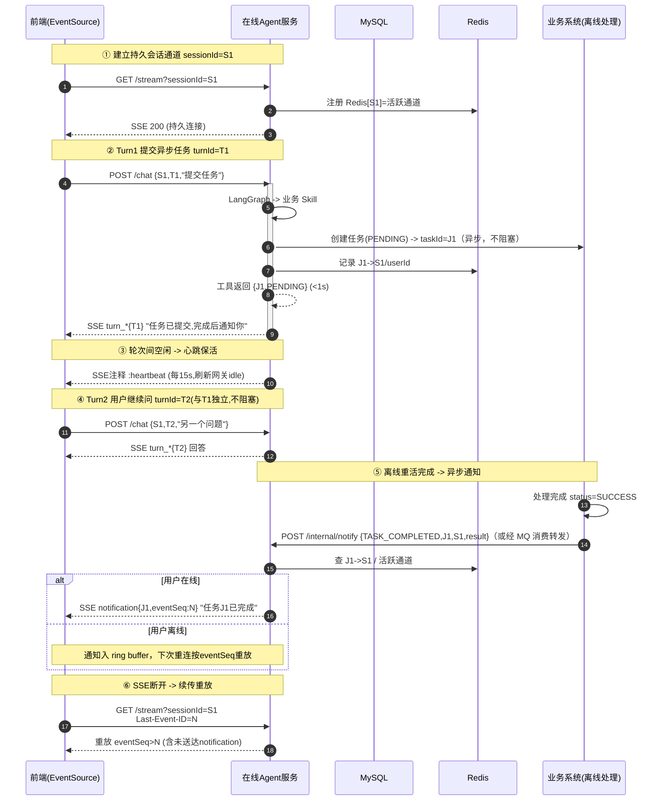

# general-agent 综合设计

> 本文档为 agent 模块**权威入口**；对外 SSE 流式协议见本文 §三，业务系统异步通知接入见 §四、API 见 `api/notify.py`，LLM 侧对接任意 OpenAI 兼容端点（`/v1/chat/completions`）。
> **实现状态已与代码核对**：核心能力（SSE 对话 / 断线续传 / 治理 / Skill / 可观测 / Web 登录认证）已实现并验证。
> 鉴权支持 `disabled`/`api_key`/`session`（Web Cookie+Session 登录）三种模式，`jwt` 为预留且 fail-closed；Web 终端用户登录/注册/多会话详见 [02-Web前端与认证设计.md](./02-Web前端与认证设计.md)。
> 架构图：[general-agent-arch.svg](./general-agent-arch.svg)、[workflow.svg](./workflow.svg)；实现级设计（Bug/决策/落点/验证）见 [01-AGENT实现设计.md](./01-AGENT实现设计.md)；部署见 [03-部署方案.md](./03-部署方案.md)；踩坑记录见 [错题本.md](./错题本.md)。
> **权威可测规格**：各能力的 OpenSpec 规格（Requirements/Scenarios）见 `openspec/specs/`，本文为架构与决策叙事。

---

## 一、定位与背景

general-agent 是**通用企业级 Agent 底座**：无状态 LangGraph 推理循环 + 持久 SSE 通道 + 多租户治理 + 可插拔 Skill + 全链路可观测，业务方通过注册 Skill 与注入服务扩展。

**核心价值：解决生产级 Agent 三大难题**

1. 🔄 **长任务不稳定**——SSE 连接空闲断开问题
2. 🔒 **安全隔离**——多租户隔离、凭证安全
3. 🔍 **可观测性**——出错了能定位根因

### 技术选型：LangGraph 编排 + 自研治理

**编排底座用 LangGraph，SSE 协议 / 隔离 / 治理 / 可观测自研在其上。**

| 候选 | 取舍 | 结论 |
|------|------|------|
| 纯自研 loop | 控制力最强、可调试，但 loop / 状态机 / checkpoint / streaming / 重试 / 可观测都要重造 | 工程量过大，弃 |
| 裸 LangChain（AgentExecutor） | 集成多但抽象重、magic 多、生产难定位 | 弃 |
| 厂商 SDK（Claude / OpenAI Agents SDK） | 代码少但绑定单一 provider，与多 provider 中立冲突 | 弃 |
| **LangGraph** | 显式图编排（状态 / 循环 / checkpoint / streaming / HITL），可控可调试可持久化，社区维护 | **采用** |

**仍自研**（LangGraph 不覆盖或不适配持久 SSE 通道模型）：SSE Translator（LangGraph stream -> UI 事件）、Producer Queue / 心跳 / 续传、多租户隔离、凭证脱敏、工具白名单、审计、可观测（OpenTelemetry）。

> 判据：模型中立由 OpenAI 兼容适配层保证、工具标准化由自研 Skill 基类保证，二者已覆盖 LangChain 的两大集成价值；剩下编排 / 持久化交给 LangGraph，协议与治理自研。

### 技术决策

| 项 | 决策 | 说明 |
|---|---|---|
| 技术栈 | Python ≥3.11 + FastAPI | 独立服务部署；uv 管理包与 venv |
| Agent 编排 | LangGraph | 推理-行动循环、状态机、streaming；**无状态图（消息历史存 MySQL，不用 checkpointer）** |
| LLM 调用 | OpenAI 兼容适配 | langchain-core ChatModel 适配层（`llm.py`）-> OpenAI 兼容 HTTP 端点（`/v1/chat/completions`），可接任意兼容服务 |
| Skill 插件 | 自研，进程内 | 业务能力封装为自研 Skill（基类+Registry），LangGraph tool node 直接调用；按 env 动态过滤 |
| 存储 | 自建/复用 | MySQL（消息历史 `agent_message` 表，惰性建表）/ Redis（瞬态会话 + 多实例 Broker，可选） |
| 部署 | 独立 Python 服务 | Skill 经 `SkillContext.services` 注入业务客户端，框架不内置业务依赖 |

> 历史路线：早期基于 Claude SDK（Java）自研的方案已归档；现以 Python + FastAPI + LangGraph 为实现路线。

### 运行环境与端口

| 项 | 决策 | 落地 |
|---|---|---|
| 运行环境 | Python ≥3.11，agent 独立服务 | `pyproject.toml` |
| 包/venv 管理 | uv | `.venv` / `pyproject.toml` |
| 端口序列 | agent 9093 / stub_llm 9094（联调用 OpenAI 兼容 stub） | `config.yaml` |
| SSE 库 | sse-starlette（`EventSourceResponse`） | `api/chat.py` |
| 前端通道 | SSE 流式（非永久长通道） | §四 |
| traceId | 前端优先（`X-Trace-Id`），无则后端生成 | `api/chat.py` |
| 流式格式 | A 结构化事件流（`event:`+`data:`），弃纯文本增量 | `events.py` |

---

## 二、整体架构

```
                        general-agent
                               │
          ┌──────────────────────┼──────────────────────┐
          │                      │                      │
     接入层                 核心层                 治理层
          │                      │                      │
   ┌──────┴──────┐        ┌──────┴──────┐        ┌──────┴──────┐
   │ SSE 协议     │        │ Producer Q  │        │ 会话治理     │
   │ Translator  │        │ Queue       │        │ 多租户隔离   │
   │ 协议翻译     │        │ 流式解耦    │        │ 凭证脱敏     │
   │ 错误降级     │        │ 流控背压    │        │ 工具白名单   │
   │ 版本隔离     │        │ 取消续传    │        │ 会话续传     │
   └─────────────┘        └─────────────┘        └─────────────┘
          │                      │                      │
          └──────────────────────┼──────────────────────┘
                                 │
                         ┌───────┴───────┐
                         │   扩展层      │
                         └───────┬───────┘
                  ┌──────────────┼──────────────┐
                  │              │              │
             Skill 插件化   全链路 Trace    心跳保活
             动态加载       结构化日志
             权限校验       Metric 统计
```

### 模块规划（M1–M9）

| 模块 | 职责 | 状态 |
|---|---|---|
| M1 骨架与配置 | 工程地基：Python + FastAPI + hatchling；env/yaml 配置；结构化日志 | ✅ |
| M2 接入层 | 自然语言入口：FastAPI `POST /chat` + `GET /stream`；SSE Translator；心跳保活；断线续传 | ✅ |
| M3 会话与上下文 | 隔离 + 记忆：`service+env+user` 隔离；四级 ID（session/turn/event/task）；消息历史落 MySQL（无状态图），Redis 仅瞬态 | ✅ |
| M4 Agent Loop | 推理-行动循环：LangGraph 无状态图编排（每轮从 MySQL 载入消息）；LLM 经 OpenAI 兼容适配层；`max_tool_rounds` 防死循环 | ✅ |
| M5 Skill 插件 | 插件机制：自研 Skill 基类 + Registry；业务能力封装为 Skill；按 env 动态加载；工具异常不杀轮次 | ✅ |
| M6 治理与安全 | 企业级护栏：多模式鉴权（disabled/api_key/session，jwt 预留 fail-closed）；凭证脱敏；限流；审计；统一 JSON 错误 | ✅ |
| M7 长任务稳定性 | 长任务不掉单：Producer Queue；心跳；eventSeq 续传；notification 异步通知 | ✅ |
| M8 可观测性 | 可定位根因：traceId / Span / 结构化日志 / Skill Metric / 错误分类 | ✅ |
| Web 前端与认证 | 终端用户登录使用：Vite+React 前端（`front/`）；Cookie+Session 登录、PBKDF2 密码、用户体系、多会话管理与历史回放（`auth.py`/`user_store.py`/`chat_session_store.py`/`api/auth_routes.py`/`api/sessions.py`） | ✅ |
| 业务 Skill 扩展 | 业务方按需实现并注册自身 Skill（客户端经 `app.state.services` 注入） | ⏳ 按需 |

---

## 三、接入层：SSE 协议翻译

### 为什么需要这一层

LangGraph 的 stream 事件（状态更新、工具调用开始/结束、token 流）是底层执行视角，前端**不能直接用**，前端需要稳定的、能理解的 UI 生命周期事件。

### 标准事件协议

每个 SSE 事件由 `event: <类型>` + `data: <JSON>` 组成；所有事件 `data` 含公共字段 `turnId`（轮次 ID，前端归位消息气泡）与 `traceId`（全链路 trace ID，前端优先生成，缺失时后端补）。

| event | 触发时机 | data 额外字段 | UI 含义 |
|---|---|---|---|
| `turn_start` | 轮次开始 | `sessionId`（会话 ID，Web 登录模式下随首帧下发，供前端建侧边栏条目/更新 URL；API 模式可能缺省） | 开消息气泡（可显示“思考中”） |
| `turn_delta` | LLM token 流 | `content`（文本片段） | 累加到当前气泡 |
| `tool_start` | 工具调用开始 | `toolCallId`、`toolName`、`args`（完整入参，非流式） | 显示“调用工具 X，参数 ...” |
| `tool_end` | 工具调用结束 | `toolCallId`、`status`（success/error）、`result` 或 `error`+`errorCode` | 显示工具结果或错误 |
| `turn_end` | 轮次结束 | `finishReason`（`stop`/`max_tool_rounds`） | 关闭气泡 |
| `error` | 异常 | `message`（用户可读）、`code` | 错误提示 |

**协议格式**：结构化事件流（`event:`+`data:`），业界主流（Vercel AI SDK / OpenAI / Anthropic 同向），非裸 `data:`。

### 工具调用语义

- **多工具/并行**：一轮 `turn` 内可含多对 `tool_start`/`tool_end`。`toolCallId` 全局唯一，取 LLM 的 `tool_call.id`，前端据此配对 start/end；并行工具调用时多个 `tool_start` 可交错，事件顺序由 `eventSeq` 保证。
- **同步工具**：`tool_end` 立即返回完整结果；执行期间靠心跳保活，不设独立进度事件（`tool_progress` 暂不引入）。
- **异步工具**（如"提交耗时处理任务"）：`tool_end` 用 `status=success`、`result={taskId, status:"PENDING"}`，表示"调用成功、任务已建"。真正完成**不发第二次 `tool_end`**，而由持久通道 `notification{taskId}` 推送；前端见 `result.taskId` 即切换为"等通知"态。
- **错误不杀轮次**：`tool_end.status=error`（带 `errorCode`）只表示该次工具失败，agent 可据此重试或换工具并继续该 turn；只有系统级故障才发独立 `error` 事件终止轮次。

### 工具调用上限（护栏）

为避免无限制工具调用或反复报错死循环，agent loop 设最大工具调用轮次 `max_tool_rounds`（默认 8，可配置）。该计数覆盖每一轮工具调用（不分成功/失败）；达到上限时翻译层捕获 LangGraph `GraphRecursionError`，发 `turn_end{finishReason:"max_tool_rounds"}`（受控终止、非崩溃，不发 `error`）。`recursion_limit=max_tool_rounds*2+1`。

### LangGraph 事件映射（M4 落地）

`on_chain_start` -> `turn_start`、`on_chat_model_stream` -> `turn_delta`、`on_tool_start` -> `tool_start`、`on_tool_end` -> `tool_end`、图正常结束 -> `turn_end{finishReason:"stop"}`、`GraphRecursionError` -> `turn_end{finishReason:"max_tool_rounds"}`、其他异常 -> `error`。

### 额外职责

错误降级（系统级异常翻译为用户可读 `error` 事件，不暴露栈）、版本隔离（事件协议可演进，前端按 event 类型解析）。

---

## 四、核心层：长任务稳定性（M7）

长时 Agent 推送面临 SSE 空闲断开问题，业界主流均为 **结构化事件流 + 心跳 + 续传**（OpenAI/Anthropic SSE typed events、Vercel AI SDK、通用网关 Last-Event-ID 重放）。SSE 标准的 `id:` 行 + 浏览器 EventSource 自动重连携带 `Last-Event-ID` 是 W3C 标准能力，最契合断线续传。三机制协同：

### ① Producer Queue

同进程内解耦执行与 SSE 推送：执行慢/卡不阻塞推送；推送断了我还能继续跑、结果不丢。内存 queue（会话生命期几分钟，零序列化零网络，延迟最低）；多实例时完成通知经 Redis Pub/Sub 路由到持有连接的实例。

> ✅ **RedisBroker 已实现**（`general_agent/redis_broker.py`）：Redis INCR 序列（跨实例唯一递增）、Redis List 环形缓冲（LTRIM 滑动窗口）、Redis Pub/Sub 跨实例通知广播。与 `Broker` 接口一致，可 drop-in 替换。9 项单测通过。

```
producer(执行) -> asyncio.Queue -> consumer(SSE 推送)
                                   └ poll(N) 超时 -> 发心跳
```

### ② 心跳保活

Consumer `queue.poll(N)` 超时发 SSE 注释行 `: heartbeat\n\n`（浏览器忽略但刷新网关 idle）。间隔（15s）必须小于链路最短超时（网关 60s），留安全余量。

### ③ 会话续传

每事件带 `eventSeq`；前端 EventSource 断线携 `Last-Event-ID` 重连；后端滑动窗口/ring buffer 重放 `eventSeq>Last-Event-ID`。上下文按 sessionId 落 MySQL（`service/env/user/sessionId` 作用域）。

| 机制 | 解决的问题 |
|------|-----------|
| Producer Queue | 断了我还能继续跑、结果不丢 |
| 心跳保活 | 没数据时连接不被当空闲掐断 |
| 会话续传 | 真断了能接上接着发 |

### 异步任务通知模式

| 工具类型 | 典型耗时 | 处理模式 |
|---------|---------|---------|
| 同步短工具 | 几十秒内、要流式进度 | 保活 + 心跳，让用户在该轮 SSE 上等 |
| 异步重任务 | 分钟~小时级（如耗时数据处理/报表生成） | 快速返回 + 持久通道异步通知 |

“异步重任务”模式：工具秒级返回 `{taskId, PENDING}`，用户立即得到响应并可继续提问；业务侧离线跑完后回调 `POST /internal/notify`（或经 MQ 消费后转发），由持久通道推送完成通知。**这个场景不需要为“提交任务”本身保活**，保活/续传保护的是承载通知的持久会话通道。

**持久通道多路复用**：一条按 `sessionId` 的持久 SSE 通道，用事件类型多路复用对话响应与通知。

| 事件类型 | 携带 | 含义 |
|---------|------|------|
| `turn_start` / `turn_delta` / `turn_end` | turnId | 某轮 agent 回答 |
| `notification` | taskId | 任务完成等异步事件 |
| `heartbeat` | - | 保活注释 |

### 完整流程

1. 前端建立持久通道 `GET /stream?sessionId=S1`，注册 `Redis[S1]=活跃通道`。
2. **Turn1**：用户提交一个异步重任务；agent 调对应业务 Skill：业务侧创建任务 `PENDING` -> `taskId=J1`；异步提交离线处理；记 `J1->S1`；**立即返回 `{J1, PENDING}`（<1s）**。
3. agent 经持久 SSE 回 `turn_*{T1}`：“任务已提交，完成后通知你”；Turn1 结束。
4. 用户继续问 Turn2/3（各自 turnId，互不阻塞）；轮次间靠 `:heartbeat` 保活。
5. **离线完成**：业务侧处理完 -> 更新 `SUCCESS` -> 经 MQ 消费或直接 webhook 回调 agent `POST /internal/notify`（`{TASK_COMPLETED, J1, S1, result}`）。
6. 在线服务处理通知 -> 查 `Redis[S1]` 活跃通道：在线则推 `notification{J1}`；离线则入 ring buffer（未读），下次重连按 `eventSeq` 重放。
7. **断线续传**：前端 `GET /stream?sessionId=S1` 携 `Last-Event-ID=N`，重放 `eventSeq>N` 的事件（含未送达 notification）。

### 时序图



### 关键取舍

- **为什么内存 Queue 而不是 MQ**：同进程内解耦，会话生命期几分钟，内存 queue 零序列化、零网络 IO，延迟最低；引入业务 MQ 要额外处理持久化、消费组、顺序、重试，对这个场景过重。跨进程通知经 `POST /internal/notify` 接入，多实例续传用 Redis（见下）。
- **多实例路由**：时序图为单实例。在线服务多实例时，完成通知需先按 `sessionId` 经 Redis Pub/Sub 路由到“持有该 SSE 连接的那台实例”再下发；`Redis[S1]` 记录的是实例标识而非通道对象。
- **效果**：长任务成功率从约 60% 提升到 99%+，且异步重任务不阻塞用户多轮对话。

---

## 五、治理层：多租户安全隔离（M6）

### 三层隔离机制

| 层级 | 隔离维度 | 具体实现 |
|------|---------|---------|
| 第一层 | **Session 隔离** | 按 `service + env + user_name` 三个维度隔离，每个组合是完全独立的会话空间，A 用户绝对看不到 B 用户的历史 |
| 第二层 | **凭证脱敏** | 所有 API Key、Token 在日志和 Trace 中都是脱敏的，不会泄露 |
| 第三层 | **工具白名单** | 每个环境能调用的工具是白名单控制的，Agent 不能随便调用不在白名单里的工具，比如测试环境就绝对不能调用生产的 API |

额外保障：每个 Skill 调用前都会检查用户有没有这个权限。

**鉴权模式**：`security.auth_mode` 支持 `disabled`（dev 放行）/ `api_key`（`X-Api-Key`，服务间/网关调用）/ `session`（Web 终端用户 Cookie+Session 登录）；`jwt` 为预留模式，配置时**fail-closed**（抛 500 `CONFIG`，不静默放行）。`session` 模式下身份来自服务端登录态（`user=uid`），配套用户体系、多会话管理与登录失败限流，详见 [02-Web前端与认证设计.md](./02-Web前端与认证设计.md)。

> M6 落地详情（鉴权模式 / env 白名单 / 令牌桶限流 / 脱敏 / 审计 / 依赖组装）见 [01-AGENT实现设计.md](./01-AGENT实现设计.md) §二；Web 登录认证（PBKDF2/Session/多会话）见 [02-Web前端与认证设计.md](./02-Web前端与认证设计.md)。权威可测规格见 `openspec/specs/governance-security` 与 `openspec/specs/web-auth-session`。

---

## 六、扩展层：Skill 插件化（M5）

### 6.1 Skill 插件化架构

每个 Skill 的三要素：元数据描述（名称、功能描述、参数列表）、执行逻辑、权限校验逻辑。

```
用户提问
    ↓
根据当前用户权限和当前环境，动态加载可用的 Skill 列表
    ↓
把这些 Skill 的描述组装成 Prompt
    ↓
发给大模型
    ↓
大模型决定调用哪个 Skill、传什么参数
    ↓
执行 Skill
    ↓
返回结果给用户
```

**动态加载设计**：不是一次性把所有 Skill 都塞给 Prompt，而是根据场景动态加载——避免 Prompt 太长、提高安全性（某环境专属 Skill 不会出现在其他环境里）。

### 6.2 自研 Skill 落点

**自研 Skill，不用 MCP**：业务方与 agent 同为 Python 生态、同机部署时，进程内直接调用最简单可控；MCP 会引入独立 server/client 进程与额外协议层，跨语言/跨进程场景再考虑。工具标准化由自研 Skill 基类保证。

- 业务能力封装为自研 `Skill`（`skills/base.py`：`Skill` 基类含 `name`/`description`/`args_schema`(pydantic)/`allowed_envs` + async `run(ctx, **kwargs)`；`SkillContext` 携带 `env`/`user`/`session_id`/`services`）。
- 业务依赖（如业务 REST 客户端）由使用方在 `app.state.services` 注入，Skill 内通过 `ctx.services["key"]` 取用；框架本身不内置任何业务客户端。
- `SkillRegistry` 显式注册（非自动扫描避免 magic），按请求 `env` 过滤后产出 LangChain `StructuredTool`（套 `tool_call` span + `agent.tool.*` metric），每请求重建 agent（动态加载，仅允许的 Skill 进 prompt）。框架默认注册表为空（纯对话），业务方在 `build_registry()` 中 register。
- agent 作 LangGraph `create_react_agent`，工具经 `ToolNode(handle_tool_errors=...)` 调用；无注册 Skill 时 tools 为空，退化为纯对话。

**扩展方式**：业务方实现 `Skill` 子类 -> 在 `skills/__init__.py` 的 `build_registry()` 注册（或自行组装 registry 覆盖 `app.state.skill_registry`）-> 所需客户端放入 `app.state.services`。

**工具异常不杀轮次**：`ToolNode` 开启 `handle_tool_errors`，工具抛异常（携带 `code` 属性时取其作为 errorCode，否则 INTERNAL）时被捕获转为 `status=error` 的 ToolMessage 供 LLM 反应并继续该 turn（不崩溃）；runner 由 `on_tool_error` 产出 `tool_end{status:error, errorCode}`，错误 ToolMessage 从 tools 节点 `on_chain_end` 捕获并持久化。

---

## 七、可观测性（M8）

### 全链路 Trace 四件套

| 层级 | 实现 | 作用 |
|------|------|------|
| 1. Trace ID | 每一次请求都有全局唯一的 Trace ID | 串联整个调用链 |
| 2. Span 统计 | 每个阶段都有独立的 Span 和耗时统计 | 定位哪个阶段慢 |
| 3. 结构化日志 | 每个阶段的输入输出都有记录 | 出问题能回溯 |
| 4. 自定义 Metric | 每个 Skill 的调用次数、成功率、平均耗时、P95 耗时 | 统计看板，告警 |

**排查流程**：先看 Metric 看板定位哪个阶段慢了 -> 再看对应 Trace 的日志 -> 最后定位是大模型响应慢了、还是工具调用慢了、还是自己的逻辑慢了。不同类型的错误有不同的告警级别，方便快速定位问题。

### M8 落地决策（OTel 全家桶）

| 项 | 决策 |
|---|---|
| 技术栈 | 方案 A：OpenTelemetry traces+metrics 经 OTLP -> Collector -> Jaeger/Tempo + Prometheus/Grafana；日志保持 structlog->stdout 注入 trace_id/span_id（不引入 OTel Logs 信号） |
| 范围 | agent Python 侧；出站经 httpx 自动 instrumentation 注入 traceparent，下游服务接 OTel 即可串联 |
| Trace 传播 | 双收：入站优先 `traceparent`、兜底 `X-Trace-Id`（32hex，生成随机 span_id 构造有效远端父 context）；出站统一 `traceparent`；SSE 事件 traceId 从 OTel span 派生 |
| 采样 | 100%（`ParentBased(root=ALWAYS_ON)`），规模化后切 Collector 尾部采样 |
| Instrumentation | 混合：FastAPI/httpx 自动（根 server span + 出站 client span + traceparent）；`run_turn`/`load_history`/`agent_graph`/`append_messages`/`llm_call`/`tool_call` 手动 span（跳过 instrumentation-langchain，避免拉入完整 langchain 包） |
| Metric | `agent.turn.duration` / `agent.llm.duration` / `agent.llm.tokens` / `agent.llm.errors` / `agent.tool.duration` / `agent.tool.calls` / `agent.tool.errors` |
| 标签基数 | 严格低基数：env/model/tool_name/status/error_code/finish_reason/kind；userId/sessionId/turnId 只进 trace span 属性 + 日志，绝不进 metric |
| 错误 severity | agent 侧映射表：AUTH/UNAVAILABLE=critical、RATE_LIMIT/TIMEOUT=warning、INTERNAL=error、CONTENT_FILTER=info；打到 span/log 属性，`max_tool_rounds` 为受控终止不算 ERROR span |
| 日志桥接 | structlog 注入 `trace_id`/`span_id`（从 OTel 当前 span 读）+ `env`/`user`/`session_id`/`turn_id`（从请求级 contextvar 读）；不引入 OTel Logs 信号 |
| Resource | `service.name=general-agent`、`service.version`、`deployment.environment`、`service.instance.id` |

落地：`observability.py`（propagator/providers/instruments/recorders/severity）、`logging_setup.py`（OTel 桥接）、`config.py`+`config.yaml`（observability 块）、`app.py`/`chat.py`/`runner.py`/`llm.py`/`health.py` 接入。

---

## 八、LLM 调用链

```
LangGraph -> ChatModel 适配层(langchain-core) -> HTTP -> OpenAI 兼容端点(/v1/chat/completions)
                                           -> 实际 LLM(任意 OpenAI 兼容服务：ARK / Ollama / DeepSeek / 内部网关等)
```

- 多 provider 中立由 OpenAI 兼容协议保证：任何提供 `/v1/chat/completions`（含 tools、SSE 流式）的端点均可接入。
- LangGraph 通过 langchain-core 的 `BaseChatModel` 抽象调用 LLM；agent 侧实现薄适配层 `OpenAICompatibleModel`（`_generate` 非流式、`_astream` SSE 流式，支持 `bind_tools`/`tool_calls`），见 `general_agent/llm.py`。本地联调用 `general_agent/stub_llm.py`（OpenAI 协议 stub，:9094）。

---

## 九、实现顺序

1. M1 骨架与配置 -> 起服 / 配置 / 日志
2. M2 接入层 -> POST /chat 回显 + traceId
3. M3 会话与上下文 -> 多用户隔离、历史累积
4. M4 Agent Loop -> LangGraph 图编排 -> LLM（OpenAI 兼容端点） -> 文本回复
5. M5 Skill 插件 -> Skill 注册/动态加载/按 env 过滤机制打通
6. M7 长任务稳定性 -> 异步任务通知、断线续传
7. M6 治理与安全 -> 鉴权 / 脱敏 / 白名单 / 限流
8. M8 可观测性 -> trace / metric 贯穿（M2 起埋 traceId）
9. M9 RAG skill -> 按需接入

---

## 十、方案追问与业界对照

### 10.1 编排底座：LangGraph vs 自研 vs 厂商 SDK

**追问**：LangGraph 抽象是否会成为黑盒？生产难定位？状态为何不用 checkpointer？

| 方案 | 优点 | 缺点 |
|------|------|------|
| A. LangGraph 无状态图（现状） | 显式图、streaming、可控；消息存 MySQL 简单 | checkpoint 能力未用，重连需自载历史 |
| B. LangGraph + checkpointer | 原生持久化/恢复 | 会话级场景过重，状态存外部 DB 反而耦合 |
| C. 纯自研 loop | 控制力最强 | loop/状态机/streaming/重试全重造 |
| D. 厂商 SDK | 代码少 | 绑定单 provider，与多 provider 中立冲突 |

**选择**：**A**。理由：会话生命期短、消息历史本就要落 MySQL 供前端展示，无状态图每轮从 MySQL 载入最直接；checkpoint 适合超长跨天工作流，对本场景过重。业界（LangGraph 官方）也支持 stateless + 外部存储模式。

### 10.2 长任务稳定性：Producer Queue vs WebSocket vs MQ

**追问**：为何 SSE + 内存 Queue 而非 WebSocket 双向 / MQ 推送？

| 方案 | 优点 | 缺点 |
|------|------|------|
| A. SSE + 内存 Producer Queue（现状） | 单向推送简单、浏览器原生 EventSource 自动重连、零序列化低延迟 | 单向（够用，前端不需回传）；多实例要 Redis Pub/Sub 路由 |
| B. WebSocket | 双向、全双工 | 双向对单向推送场景过重；重连/心跳/代理兼容要自处理 |
| C. MQ 直推前端 | 解耦强 | 前端不直连 MQ；多了消费组/顺序/重试复杂度 |

**选择**：**A**。理由：agent->前端是单向流式推送，SSE 最简且浏览器原生支持自动重连（携 `Last-Event-ID`）；内存 Queue 解耦同进程执行与推送，延迟最低。真正跨进程（多实例路由、业务异步任务完成通知）才用 Redis Pub/Sub（多实例 Broker）或业务侧 MQ 经 `/internal/notify` 接入。业界（OpenAI/Anthropic/Vercel）流式均 SSE。

### 10.3 Skill：自研 vs MCP

**追问**：MCP 是 Anthropic 推的工具协议标准，为何不用？

| 方案 | 优点 | 缺点 |
|------|------|------|
| A. 自研 Skill 进程内（现状） | 同生态同机，进程内调用最简可控；零额外进程 | 跨进程/跨语言工具需自包装 |
| B. MCP | 标准协议、跨进程、生态可复用 | 引入 server/client 进程+协议层，对同机 Python 场景过重 |

**选择**：**A**。理由：业务 Skill 与 agent 同 Python 生态、同机部署时进程内直调最简；工具标准化由自研 Skill 基类保证。MCP 价值在跨进程/跨语言工具复用，若未来工具能力拆为独立多语言服务，再评估 MCP。

### 10.4 续传：eventSeq ring buffer vs 落库游标

**追问**：断线续传用内存 ring buffer 还是落库？

| 方案 | 优点 | 缺点 |
|------|------|------|
| A. 内存 ring buffer（窗口） | 快 | 实例重启丢；窗口外丢 |
| B. 落库游标（eventSeq 持久） | 重启不丢 | 每事件落库 IO |
| C. Redis 滑动窗口 | 跨实例、TTL 自动清理 | 每事件一跳 Redis |

**选择**：**分阶段（A 单实例先行，C 多实例扩展）**。理由：当前单实例用内存 ring buffer（零序列化零网络、延迟最低）；多实例下「持有连接的实例」可能变，续传重放须跨实例可见，届时切 Redis 滑动窗口（List+TTL）+ Pub/Sub 通知广播，**Broker 接口不变**（见 01-AGENT实现设计 §1.4）。`notification` 离线未读可落 MySQL。eventSeq 单实例由 Broker 内存 `next_seq`，多实例由 SessionStore `next_event_seq`（Redis INCR）提供。

### 10.5 多租户隔离强度

**追问**：env 白名单够不够？测试 env 调生产 API 如何绝对禁止？

**选择**：**白名单 + 配置级硬隔离**。Skill `allowed_envs` 在 Registry 过滤阶段即剔除（不进 prompt），非运行时校验；凭证按 env 分离配置（测试 env 不持有生产 API Key）。纵深：prompt 不含 -> Registry 不注册 -> 即便 LLM 幻觉调用也因工具不存在而失败。

---

## 十一、关键成果

| 指标 | 数值 |
|------|------|
| 长任务成功率 | 60% -> 99%+ |
| 隔离维度 | 3 层（service/env/user_name） |
| 可观测性 | 全链路 Trace + Metric |
| 协议兼容性 | 前端 SDK 升级无感知 |
| Skill 扩展性 | 自研 Skill 注册即用，按 env 动态加载 |

---

## 十二、待确认开放问题

- ✅ LLM 接入：已实现 OpenAI 兼容适配层，任意提供 `/v1/chat/completions`（含 tools、SSE 流式）的端点均可接入；本地联调用 `stub_llm.py`（:9094）。
- ✅ agent 对前端 SSE 流式协议（**A 结构化事件流**，与业界主流 Vercel AI SDK / OpenAI / Anthropic 同向），事件定义见 `events.py`、协议见本文 §三。
- ✅ Skill 实现方式：自研 Skill 插件（不用 MCP），进程内 Skill 基类 + SkillRegistry 按 env 动态加载；框架默认无业务 Skill，业务方注册扩展，详见 §6.2。
- ✅ 服务间鉴权：治理鉴权可配置 `disabled`/`api_key`/`session`（`jwt` 预留且 fail-closed，见 02）；业务异步通知经 `POST /internal/notify` 接入（服务间 api_key 鉴权）；生产建议网关 mTLS。
- ✅ LangGraph ChatModel 适配层：已实现 `OpenAICompatibleModel`（langchain-core `BaseChatModel` 包装 OpenAI 兼容 HTTP；`_generate` 非流式、`_astream` SSE 流式，支持 `bind_tools`/`tool_calls`），见 `general_agent/llm.py`。
- ✅ 可观测性已实现（OTel 全家桶，详见 §七）。
- ✅ Skill 插件机制已实现（自研 Skill，工具异常不杀轮次，详见 §6.2）。

| 项 | 优先级 | 说明 |
|----|--------|------|
| 服务间鉴权 | ✅ 已实现 | 治理鉴权 `disabled`/`api_key`/`session`（`jwt` 预留 fail-closed）+ 网关信任模式；Web 登录认证见 02；mTLS 为生产前置网关纵深 |
| 业务 Skill 接入 | P1 | 业务方实现 Skill 子类并在 `build_registry()` 注册，客户端注入 `app.state.services` |
| 真实 LLM 端点切换 | P1 | stub_llm 换 `llm.base_url`/`llm.api_key`/`llm.model` |
| 多实例 Redis 升级 | P2 | seq/ring/notify 切 Redis（`RedisBroker` 已实现，接线即可） |

---

## 十三、实现进度

| 模块 | 状态 | 说明 |
|---|---|---|
| M1 骨架与配置 | ✅ 已实现 | FastAPI 起服、env/yaml 配置、结构化日志 |
| M2 接入层 | ✅ 已实现 | `POST /chat` SSE；traceId 前端优先、无则后端生成 |
| M3 会话与上下文 | ✅ 已实现 | service/env/user 隔离；MySQL 消息历史；Redis 瞬态 |
| M4 Agent Loop | ✅ 已实现并验证 | LangGraph 无状态图 + OpenAI 兼容适配层；`tool_start`/`tool_end` 协议；`max_tool_rounds` 兜底（`recursion_limit=max_tool_rounds*2+1`）；`/chat` 端到端打通（stub_llm + MockTransport 验证） |
| M5 Skill 插件 | ✅ 已实现并验证 | 自研 Skill（Skill 基类 + SkillRegistry 按 env 动态加载，业务依赖经 `SkillContext.services` 注入）；ToolNode(handle_tool_errors) 工具异常不杀轮次；/chat 端到端验证（成功流 + 错误流 + 错误 ToolMessage 持久化，测试用内联 DemoSkill） |
| M6 治理与安全 | ✅ 已实现并验证 | governance_dep 鉴权链（disabled/api_key/session，jwt 预留且 fail-closed 抛 CONFIG）+ env 白名单运行时校验 + 内存令牌桶限流 + structlog 脱敏处理器 + 审计日志；GovernanceError 统一 JSON 错误 |
| M7 长任务稳定性 | ✅ 已实现并验证 | Broker 事件中枢（seq+ring+fan-out+背压）；POST /chat producer/consumer 解耦 + 心跳；GET /stream Last-Event-ID 续传 + notification 多路复用；POST /internal/notify 通知接入；uvicorn 真实服务器 e2e 验证 |
| M8 可观测性 | ✅ 已实现并验证 | OTel traces+metrics（OTLP）；双收 propagator（traceparent/X-Trace-Id）；100% 采样；7 项低基数 metric；severity 映射；structlog OTel 桥接；InMemory exporter 验证 span 树/traceId/metric/死循环兜底 |
| Web 前端与认证 | ✅ 已实现并验证 | Vite+React+TS 前端（`front/`，豆包风格、SSE 流式、工具卡片、会话管理）；后端 Cookie+Session 登录（PBKDF2 密码、HttpOnly cookie、即时吊销、登录失败限流）；用户表/多会话表惰性自建；会话归属校验越权返回 404；详见 [02](./02-Web前端与认证设计.md) |
| M9 RAG Skill | ⏳ 可选 | 按需接入 |

> M4 验证方式：`stub_llm.py`（OpenAI 协议 stub）+ runner（httpx MockTransport，正常轮次 & 死循环兜底）+ `/chat`（覆盖 `app.state` 端到端）。真实 LLM 端点就绪后换 `llm.base_url` 即可。
> M5 验证方式：覆盖 `app.state`（MockTransport 注入 OpenAI SSE LLM + FakeStore）端到端：成功流（工具调用 -> `tool_end{success}` -> 回答）与错误流（工具抛带 code 异常 -> `tool_end{error,NOT_FOUND}` -> LLM 继续反应 -> `turn_end{stop}`，错误 ToolMessage 持久化），测试用内联 DemoSkill 驱动。
> 全量验证详见 [01-AGENT实现设计.md](./01-AGENT实现设计.md) §七。

---

## 十四、文档来源

本文档为 general-agent 的综合设计（架构与决策叙事）。

- 实现级设计（Bug/决策/落点/验证）：[01-AGENT实现设计.md](./01-AGENT实现设计.md)
- Web 前端与 Cookie/Session 认证：[02-Web前端与认证设计.md](./02-Web前端与认证设计.md)
- 部署方案（Docker Compose 单机）：[03-部署方案.md](./03-部署方案.md)
- 踩坑与根因记录：[错题本.md](./错题本.md)
- 架构图：[general-agent-arch.svg](./general-agent-arch.svg)、[workflow.svg](./workflow.svg)
- 权威可测规格（Requirements/Scenarios）：`openspec/specs/`（chat-sse-protocol / conversation-broker / agent-loop / llm-adapter / skill-plugin / governance-security / web-auth-session / observability / deployment）